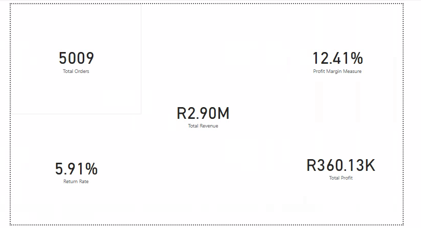
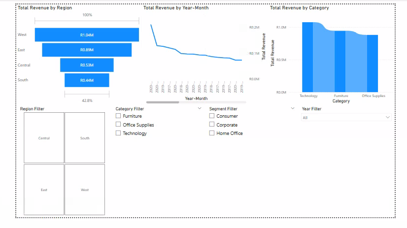
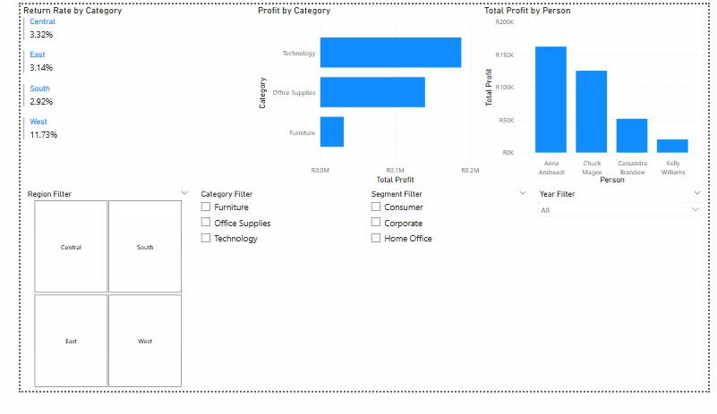

### Sales & Returns Performance Analysis (Superstore)
#### Project Overview
This project focused on analyzing retail sales and returns data using Power BI. The goal was to evaluate revenue, profitability, return behavior, and regional performance, and present actionable business insights through an interactive dashboard.

#### Tools Used
Power BI,
DAX.

#### Key Tasks Performed
Cleaned and transformed raw sales data.
Performed feature engineering including profit margin, discount segmentation, sales categorization, and shipping duration.
Integrated multiple datasets (Orders, Returns, and People).
Developed DAX measures for key metrics such as revenue, profit, return rate, and profit margin.
Built an interactive dashboard for business analysis.

#### Key Insights
5,009 total orders analyzed.
12.41% profit margin.
5.91% return rate.
West region generated the highest revenue.
Technology was the top-performing category.
Anna Andreadi generated the highest total profit.

### Dashboards Preview

